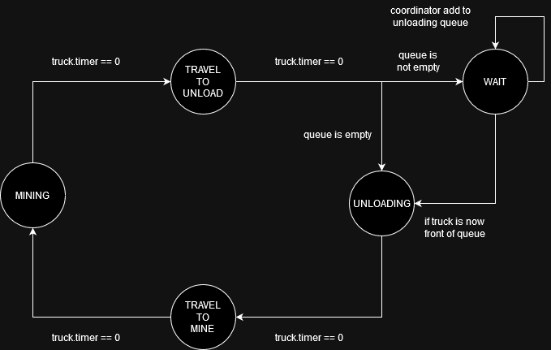

## VAST MINING SIMULATOR
This software was developed by Jimmy Nguyen using Python 3.9.13

### SETUP
1. Clone repository
1. Create a virtual environment ```python -m venv venv```
1. Activate the environment
1. Install packages ```python -m pip install -r requirements.txt```

### RUN SIMULATOR
1. Configure simulation parameters in ```sim_parameters.ini```
1. From root folder run ```python ./simulator.py```

### RUN UNIT TESTS
1. From root folder run ```python -m unittest discover```

## SOFTWARE INFO

### STATE MACHINE OVERVIEW
